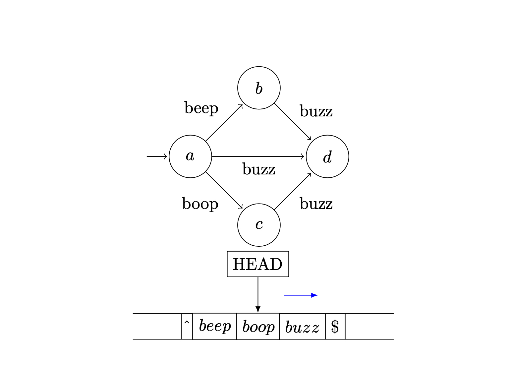

<div align="center">




<h1> ted: Turing EDitor </h1>
A tool for editing files according to the rules of a provided Turing Machine

</div>

* [Demo](#demo)
* [Motivation](#motivation)
* [Installing](#installing)
* [Examples](#examples)
* [Flags](#flags)
* [Syntax](#syntax)
* [Contact](#contact)

## Demo 

ted now has a live demo! [Try it out here](https://www.ahalbert.com/projects/ted/ted.html).

## Motivation

Once, I was presented with an the following file (abridged) 

```
INFO:2024-12-07 13:01:40:Trace:198d079c-af9a-45b2-8236-7fbb2a012f69:Starting Procedure foo
ERROR:2024-12-07 13:01:41:Trace:198d079c-af9a-45b2-8236-7fbb2a012f69:Error 1
INFO:2024-12-07 13:01:41:Trace:198d079c-af9a-45b2-8236-7fbb2a012f69:Ending Procedure foo
INFO:2024-12-07 13:01:41:Trace:198d079c-af9a-45b2-8236-7fbb2a012f69:Starting Procedure bar
INFO:2024-12-07 13:01:41:Trace:198d079c-af9a-45b2-8236-7fbb2a012f69:Error 2
INFO:2024-12-07 13:01:41:Trace:198d079c-af9a-45b2-8236-7fbb2a012f69:Success
INFO:2024-12-07 13:01:42:Trace:198d079c-af9a-45b2-8236-7fbb2a012f69:Ending Procedure bar
INFO:2024-12-07 13:01:42:Trace:30019fff-7645-4d07-9fc4-0bbb39aa09db:Starting Procedure foo
INFO:2024-12-07 13:01:42:Trace:30019fff-7645-4d07-9fc4-0bbb39aa09db:Success
INFO:2024-12-07 13:01:42:Trace:30019fff-7645-4d07-9fc4-0bbb39aa09db:Ending Procedure foo
INFO:2024-12-07 13:01:43:Trace:30019fff-7645-4d07-9fc4-0bbb39aa09db:Starting Procedure bar
ERROR:2024-12-07 13:01:43:Trace:30019fff-7645-4d07-9fc4-0bbb39aa09db:Error 3
ERROR:2024-12-07 13:01:43:Trace:30019fff-7645-4d07-9fc4-0bbb39aa09db:Error 4
INFO:2024-12-07 13:01:44:Trace:30019fff-7645-4d07-9fc4-0bbb39aa09db:Ending Procedure bar

```

I wanted only the errors that did not have a success in the procedure. In this case, we should only get Errors 1,3,4

```
ERROR:2024-12-07 13:01:41:Trace:198d079c-af9a-45b2-8236-7fbb2a012f69:Error 1
ERROR:2024-12-07 13:01:43:Trace:30019fff-7645-4d07-9fc4-0bbb39aa09db:Error 3
ERROR:2024-12-07 13:01:43:Trace:30019fff-7645-4d07-9fc4-0bbb39aa09db:Error 4 
```


I created an `awk` program to keep track of things and get the correct output. But I thought it was easier to express what I wanted as a state machine. Thus was born `ted`, a language for specifying state machines and using them to process files. 

An equivalent `ted` program:

```
startstate: /Starting.Procedure/ -> capture_begin
capture_begin: { 
	start capture 
	-> lookforsuccessorending 
	/Success/ -> startstate
}
lookforsuccessorending: /Success/  -> startstate 
lookforsuccessorending: /Ending.Procedure/ { 
	stop capture 
	print 
	-> startstate 
}

```

# Installing

Requires go 1.22

```
git clone git@github.com:ahalbert/ted.git
cd ted
go install
```

You can build the code using

```
make build
make test
```

## Examples

### Run sed only after seeing multiple patterns

Given the input:

```
baz
foo
baz
bar
baz
```

And you only want to edit the final `baz` into `bang`, use this command:

```
$ echo "baz\nfoo\nbaz\nbar\nbaz" | ted '/foo/ -> /bar/ -> do s/baz/bang/'
```

Results in: 

```
baz
foo
baz
bar
bang
```

### Print Lines Between /regex/

Given the input:

```
DO NOT PRINT THIS LINE
baz - DO NOT PRINT THIS EITHER
foo
bar
baz - DO NOT PRINT THIS EITHER
DO NOT PRINT THIS LINE
```

And you only want to print what's between the `baz`s

```
$ ted -n 'stop:/baz/ -> start start:/baz/ -> 1 start: print' < file.txt
```

Results in:

```
foo
bar
```

### Run sed if /regexs/ are seen, but reset if /badregex/ is seen

Given the input:

```
beep
boop
buzz
cheater
beep
boop
cheater
```

And you want to modify `cheater` to `nose` only if you see a beep and buzz, but if there's a `buzz`, start looking for `/beep/` again

```
$ ted '/beep/ -> {/boop/ -> /buzz/ -> 1} {do s/cheater/nose/ /buzz/ -> 1}' < file.txt
```

Results In:

```
beep
boop
buzz
cheater
beep
boop
nose
```

### Capturing 

*Capturing* enables you to read input into a variable rather than printing it on the screen. 

#### Capture single line

Given the input:

```
beep
boop
foo
bar
baz
buzz
```

You can capture one line as so:

```
1: /beep/ ->
2: {capture mycapture -> }
3: do s/THIS.IS.CAPTURED/CAPTURED/ mycapture
3: /buzz/ -> 
4: print mycapture

```

This program removes the `boop`, captured into the variable `$_`:

```
beep
boop
foo
buzz
CAPTURED
bar
CAPTURED
baz
```

#### Capture multiple lines

Given the input:

```
beep
boop - CAPTURED
foo - CAPTURED
bar - CAPTURED
baz
buzz
```

And running this `ted` program with `--no-print` option:

```
/beep/ ->
/boop/ {start capture ->} 
/baz/ {stop capture print -> 1}
```


Yields:

```
boop - CAPTURED
foo - CAPTURED
bar - CAPTURED
```

### Regex Capture Groups

You can store capture groups in a variable and refer to them later.

Given the input: 

```
beep
boop
i want these and those
foo
bar
baz
buzz
```

And this program with the `--no-print` option: 

```
/i.*want.(these).and.(those)/ ->
{println $1 println $2 ->}
```

Yields:

```
these
those
```

### Rewind and Fast-Forward

You can rewind or fast-forward the input file to any point matching `/regex/`

Given the file:

```
beep
boop
buzz
foo
bar
baz
```

#### Print everything after regex

```
{ capture fastforward /buzz/ -> }

```

#### Print a file twice

```
/baz/ { rewind /beep/ -> }
```

## Flags

```
Usage: ted [--fsa-file FSAFILE] [--no-print] [--debug] [--var key=value] [PROGRAM [INPUTFILE [INPUTFILE ...]]]

Positional arguments:
  PROGRAM                Program to run.
  INPUTFILE              File to use as input.

Options:
  --fsa-file FSAFILE, -f FSAFILE
                         Finite State Autonoma file to run.
  --no-print, -n         Do not print lines by default.
  --debug                Provides Lexer and Parser information.
  --var key=value        Variable in the format name=value.
  --help, -h             display this help and exit
```

## Syntax

ted consists of *states*, which contain *actions*. During each execution, `ted` will:

1. Read a line from the input.
2. Execute each action for that state in the order parsed
3. If an action requires it to move state, stops executing actions and moves to the next line.
4. Prints a line unless `--no-print` or capturing is on.


### Statement

```
[<statename>:] Action
```

Binds the Action to the state `statename`. If a state is not specified, it is an *Anonymous State*, and assigned a name from 1..N, incrementing each time a new state is created. Multiple actions in a statement can be combined using `{ }`. If you want to specify multiple different rules for the same state, use `,`


### Action

Various actions can be specified in a state:


#### Assign Variable

`let variable = expr`

Assigns `variable` to `expr` 

#### Do action on Regex

`/<regex>/ Action`

Perform `Action` if the current line matches regex. If capture groups are used, you may assign them to variables using `$0, $1, $2...` 

#### Do Sed Action

`do s/sed/command/g [variable]`

Execute `sed` command on `variable`. If no `variable` is specified, assumes the current line or capture. 

#### Goto Action

`-> [statename]`

Change current state to `statename`. If a state is not specified, assumes the next state listed in the program. If this is the last state, goes to state "0". 


#### Do multiple actions

`{ Action... }`

Runs all the actions between the `{` and `}`.

#### Print

`print [variable]`

Prints `variable`. If a variable is not specified, uses `$_` which can be the current line or capture.

`println [variable]`

Prints `variable` with a newline. If a variable is not specified, uses `$_` which can be the current line or capture.


#### Capture

`[start|stop] capture [variable]`

Starts/Stops capturing to `variable`. When capturing is started, input lines are redirected to . If variable is not specified, defaults to `$_`. If `start|stop` is not given, only captures the current line. 


#### Move head 

`rewind|fastforward /regex/`

Moves the head backwards/forward to the first line matching `regex`. Stops if it hits the beginning, or halts if it hits the end of file. 

### Predefined Variables

* `$_` The default variable used by arguments. At the beginning of an iteration, stores the current line in `$_` unless it is being used to capture. 
* `$@` Contains the original line read in during the iteration.
* `$0` Contains the matched text of the last regex compared.
* `$1..$N` Contains the first to N capture groups in the last regex compared

## Contact 

Feedback is always appreciated, you can contact me at armand (dot) halbert (at) gmail.com
